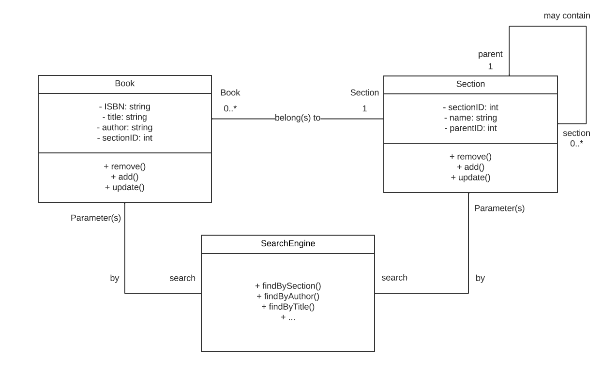

# Console library system

This is a library management system designed to provide users with a simple yet effective way to interact with the library database through a user-friendly console interface.

## Description

This is the UML diagram of the solution:

This project allows users to search, filter, and perform CRUD (Create, Read, Update, Delete) operations on available data. It's worth noting that no external database libraries were utilized in the development of this project.

## Authors

Adam Rogowski

[Mikołaj Blinowski](https://github.com/miko3412)

Maksim Szaszkow
